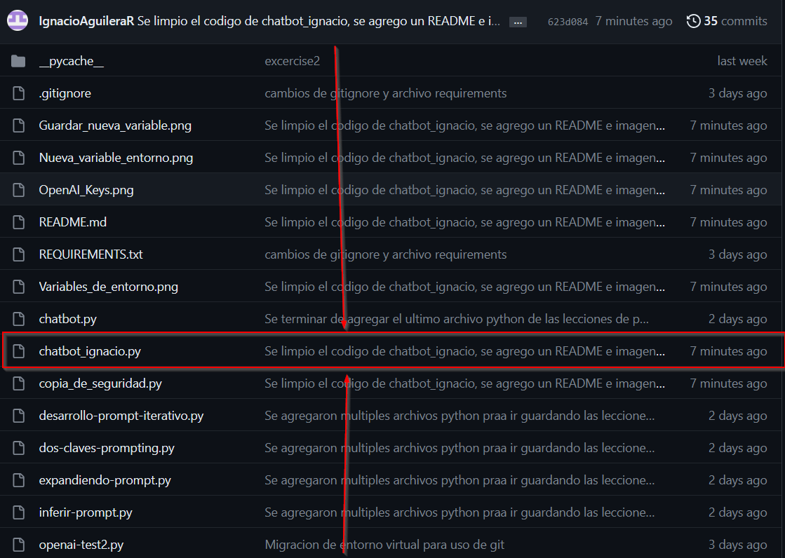

# ChatBot Ignacio

El objetivo de este programa es devolverle al "cliente" (que es quien utilizara el programa), la información que solicite.

## Para poder ejecutar el código tienes que seguir los siguientes pasos:

### 1- Crea un entorno virtual en la carpeta donde tendrás los archivos del proyecto:

Abre una terminal e ingresa el siguiente código:

```python -m venv nombre_del_entorno```


### 2- Instalar las librerías necesarias

Abre una terminal e ingresa el siguiente código para instalar las librerías necesarias:

```pip install -r REQUIREMENTS.txt```

### 3- Agregar llave de OpenAI las variables de entorno de tu sistema o sesión

Ya que este programa consume la API de OpenAI por lo que necesitaras agregar la llave que tengas en tus variables del sistema o sesión

- Primero ingresa a tus variables de entorno del sistema:


- Segundo debes presionar el botón "Nueva..." en el entorno que tú prefieras, puede ser en el usuario o en el sistema


- Finalmente, debes ingresar el nombre de la variable en el campo "Nombre de la" y la llave de OpenAI en el campo  
"Valor de la".

>[!IMPORTANT]
>
>Dentro del campo "Nombre de la" debes ingresar literalmente: OPENAI_API_KEY


- Deberia quedar algo asi:


## Si seguiste los pasos correctamente, deberías ser capaz de ejecutar el programa correctamente y probarlo

- Este es el archivo que debes ejecutar:



>[!IMPORTANT]
>
>- Necesitas una llave de OpenAI para poder utilizar este programa
>
>- Después de ingresar la primera entrada, se le solicitará al cliente que ingrese su número del documento de identidad, el cual es:  
>```20252598```
>
>- Para cerrar el programa en cualquier momento simplemente deberás ingresar:
>
>```exit```